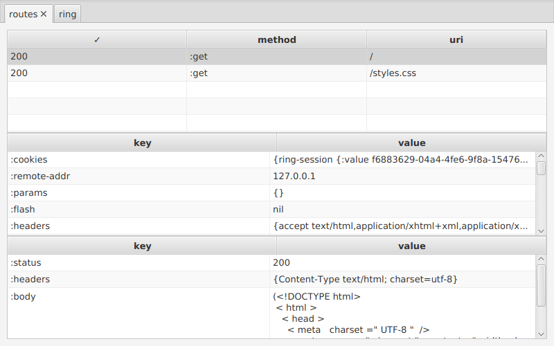

# Tracer GUI



## Artifacts

[](https://clojars.org/tracer-gui)

## Usage

Wrap your Ring handler in `trace-ring`, a GUI will pop up where you see the
history of request, and you can inspect request and response maps.

Only one window will be open at a time. Evaluate `trace-ring` again to re-open a
closed window.

```
(ns my-app.server
  (:require [tracer-gui.core :refer [trace-ring]]))

(def my-routes ,,, ;; ring routes
  )

(def http-handler
  (trace-ring my-routes))
```

This is alpha level software, provided **as is**. Pull requests are welcome!

## License

All code and content Copyright © 2016 Arne Brasseur

Distributed under the [Mozilla Public License 2.0](https://www.mozilla.org/en-US/MPL/2.0/), see LICENSE.

[tl;dr](https://tldrlegal.com/license/mozilla-public-license-2.0-%28mpl-2%29)

**This is only a short summary of the Full Text, this information is not legal advice.**

MPL is a copyleft license that works on individual files. Any changes you make to files covered by MPL must be made available under MPL, but you may combine these with non-MPL (proprietary) source files in the same project. Version 2.0 is compatible with GPL version 3. You can distribute binaries under a proprietary license, as long as you make the source available under MPL.
